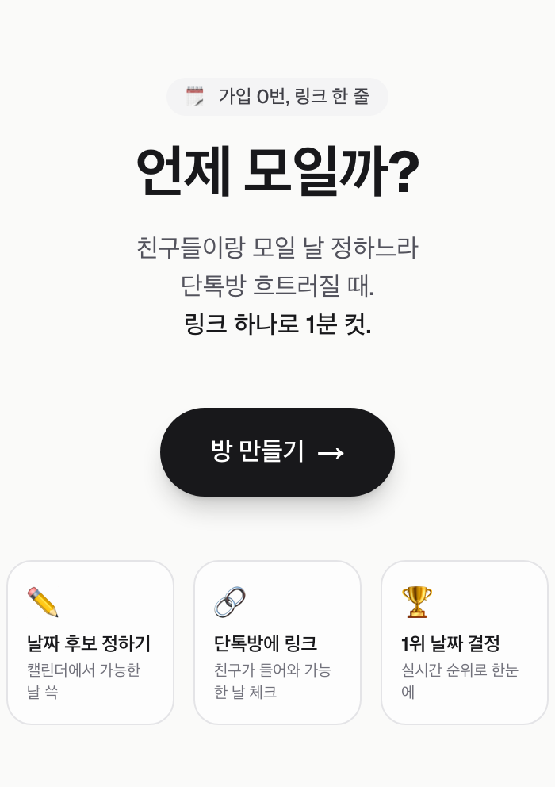
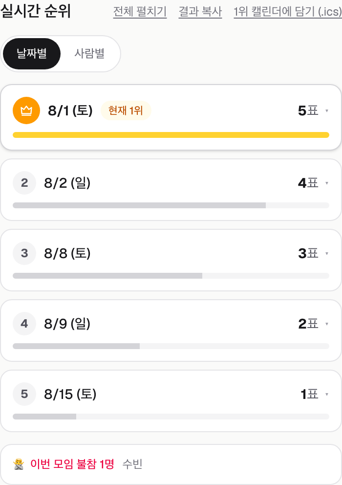

# Changhyun Kim

### Backend Engineer · Reliability · Observability

“누군가 하겠지”를 기다리지 않습니다. 문제를 재현하고, 측정하고, 직접 해결합니다. 
I don’t wait for someone else to solve it. I reproduce the problem, measure it, and build the solution myself.

[GitHub](https://github.com/milcho0604) · [Email](mailto:milcho0604@gmail.com) · [Technical writing](https://velog.io/@milcho0604/posts)

## About me

협업툴 **FLOW**의 백엔드 개발자로 일하며, 메시징 신뢰성·성능·관측 가능성과 운영 자동화에 관심이 많습니다. 
불편을 발견하면 재현 가능한 증거를 만들고, 코드와 도구로 끝까지 해결하는 편입니다.

I am a backend engineer working on **FLOW**, a collaboration platform. My interests include messaging reliability, performance, observability, and operational automation. I enjoy turning hard-to-reproduce production problems into measurable evidence and maintainable solutions.

## Featured project — [모일까? (moilga)](https://moilga.com)

> 친구들이 모일 날짜를 회원가입 없이 링크 하나로 정하는 실시간 일정 투표 서비스 
> A real-time group scheduling app that works with one link and no sign-up.

[**Live service**](https://moilga.com) · [**Source code**](https://github.com/milcho0604/daypoll)

  
  

 

- 직접 기획·개발·운영하는 개인 프로젝트로, 회원가입 없이 날짜별·사람별 실시간 투표부터 일정 확정과 `.ics` 내보내기까지 제공합니다.
- 닉네임과 선택형 PIN으로 여러 기기에서 투표를 복원하고, Socket.IO와 폴링 fallback으로 결과를 실시간 동기화합니다.
- **Next.js 16, NestJS 11, PostgreSQL 16** 기반으로 API·DB·백업을 Docker에서 직접 운영하며, Cloudflare Tunnel·CI/CD·uptime 점검·백업과 데이터 정리를 자동화했습니다.

## Open source contributions

**3 merged · 1 awaiting review**

- **VeXell/pm2-prom-module** · [Merged · PR #16](https://github.com/VeXell/pm2-prom-module/pull/16) 
  Fixed stale dynamic metric snapshots when a metric becomes an empty series.
- **VeXell/pm2-prom-module-client** · [Merged · PR #1](https://github.com/VeXell/pm2-prom-module-client/pull/1) 
  Replaced an `any` IPC metrics payload with a type inferred from `prom-client`.
- **prometheus/client_js** · [Merged · PR #786](https://github.com/prometheus/client_js/pull/786) 
  Exported public metric types and added TypeScript consumer coverage.
- **Microsoft TypeScript Website** · [Awaiting review · PR #3615](https://github.com/microsoft/TypeScript-Website/pull/3615) 
  Documented implicit export visibility in declaration-file modules with verified examples.

## Selected projects

### [TODAKTODAK](https://github.com/milcho0604/TodakTodak_backend)

실시간 소아과 예약·대기 현황과 비대면 진료를 구현한 팀 프로젝트로, **한화시스템 BEYOND SW Camp 7기 최종 프로젝트 1위**를 수상했습니다. 
A real-time pediatric reservation and telemedicine platform. **1st-place final project at Hanwha Systems BEYOND SW Camp.**

**Role:** Backend · Frontend · Deployment 
`Spring` `Vue.js` `Kubernetes` `Kafka` `Prometheus` `Grafana` · [Frontend](https://github.com/milcho0604/TodakTodak_frontend)

### [MealPlan](https://github.com/milcho0604/MealPlanning)

가족·그룹이 식단과 냉장고 재료, 쇼핑 목록을 함께 관리하고 알림을 받는 개인 프로젝트입니다. 
A personal mobile project for shared meal planning, pantry management, shopping lists, and scheduled notifications.

`React Native` `Expo` `NestJS` `Turborepo` `Supabase` `AWS S3`

### Published Chrome extensions

- **[Universal Decoder](https://github.com/milcho0604/universal-decoder)** — URL, Base64, JWT 등 10가지 이상의 인코딩을 자동 감지해 로컬에서 디코딩합니다. [Chrome Web Store](https://chromewebstore.google.com/detail/universal-decoder-all-in/ghkcchkhafjdhahkmkbakfedbbifdibb)
- **[Emoji Pocket](https://github.com/milcho0604/EMOJI-POCKET)** — 한글·영문 검색, 즐겨찾기, 최근 사용과 기기 간 동기화를 지원합니다. [Chrome Web Store](https://chromewebstore.google.com/detail/%EC%9D%B4%EB%AA%A8%EC%A7%80-%ED%8F%AC%EC%BC%93/nopjdllffljcogdfcilmhhbjjjanoccj)

## Technologies

| Area | Technologies |
|---|---|
| **Backend** |   |
| **Data & messaging** |   |
| **Platform & operations** |   |
| **Observability** |   |
| **Frontend & mobile** |   |
